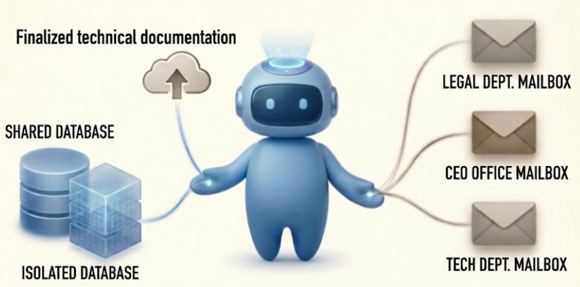

# SmartReviewAgent - An agent that guides you to make a technical documentation that fulfill the EU regulations

  

## Database design
| Shared DB ||
|-----------|-------------------|
| Shipping regulation |
| **User A DB** | **User B DB** |
| 1. User sessions | 1. Setting up toaster documentation |
| 2. Agent memory |2. What user trying to do |
| 3. User uploaded document |3. HBM machine draft |
| 4. Contact email |4. hr@hbm.com |
## Contents

- `Investigation.md` — company evaluation of Pergamon Labs (client reach, founders, core technical skills, replaceability analysis) using the mentor's company-vetting framework
- `ppwr_regulation.txt` / `ppwr_full.html` — full text of EU Packaging & Packaging Waste Regulation (EU) 2025/40
- `ppwr_annex_vii_technical_doc_spec.txt` — Annex VII Module A: technical documentation spec (conformity assessment)
- `ppwr_annex_viii_doc_model.txt` — Annex VIII: EU Declaration of Conformity model
- `lvd_2014_35_regulation.txt` / `lvd_2014_35.html` — Low Voltage Directive 2014/35/EU (free movement of electrical equipment)
- `railway-hermes/` — deploy bundle to run Hermes Agent on Railway (Dockerfile, entrypoint, railway.toml)

## Sources
- EUR-Lex (official EU legal texts; retrieved via Wayback snapshots)
- Company websites / LinkedIn (public info)

*Third-party copyrighted documents (e.g. product manuals) are intentionally not included in this repo.*
